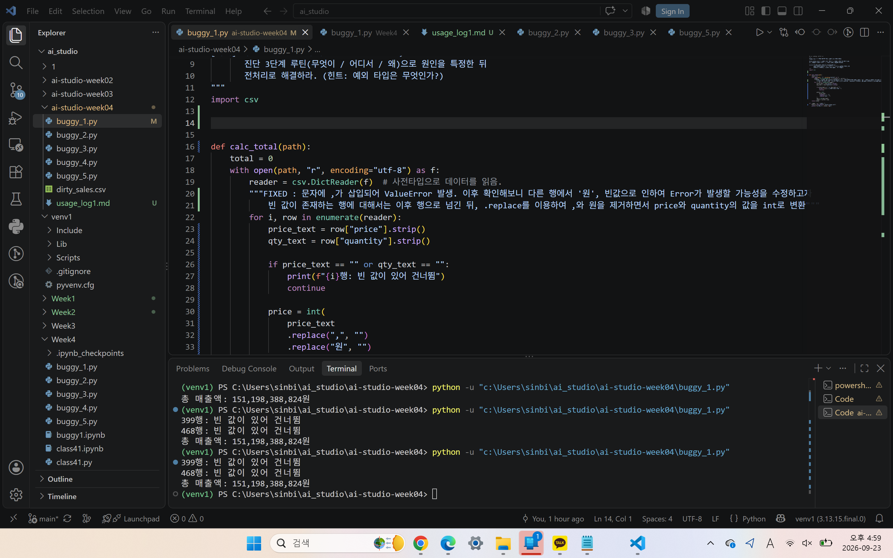

buggy_1

1단계 : 
ValueError : invalid literal for int() with base 10: '5,200' 
5,200의 타입이 int가 아니어서 문제가 발생

2단계 :
19줄 calc_total 함수의 price = int(row["price"])에서 문제가 발생.

3단계 :
25줄에서 total = calc_total("./dirty_sales.csv")로 calc_total을 호출해서 19줄에 도달

4단계 :
가설 - 5,200의 콤마로 인하여 int형이 안 됨.

프롬프트 :
월별 매출 집계 스크립트야. 아래 함수에서 첨부한 ValueError가 발생해. 에러 메시지로 추측한 문제 값은 5,200으로 콤마가 포함된 문자열이야. 
이 Traceback의 원인을 설명하고 내 가설이 맞는지 검증하는 코드를 제안한 뒤 다른 행에도 같은 문제가 있는지 확인하는 방법을 알려줘. 

def calc_total(path):
    total = 0
    with open(path, "r", encoding="utf-8") as f:
        reader = csv.DictReader(f)  # 사전타입으로 데이터를 읽음.
        for i, row in enumerate(reader):
            price = int(row["price"])        # <-- 여기가 문제의 줄
            qty = int(row["quantity"])
            total += price * qty
    return total

Traceback (most recent call last):
  File "c:\Users\sinbi\ai_studio\ai-studio-week04\buggy_1.py", line 25, in <module>
    total = calc_total("./dirty_sales.csv")
  File "c:\Users\sinbi\ai_studio\ai-studio-week04\buggy_1.py", line 19, in calc_total
    price = int(row["price"])        # <-- 여기가 문제의 줄
ValueError: invalid literal for int() with base 10: '5,200'

AI 답변 요지:
가설이 맞음
    for i, row in enumerate(reader, start=2):
        try:
            int(row["price"])
        except ValueError:
            print(f"{i}행 문제 발견: price={row['price']!r}")
-> 이를 통해서 다른 행에도 문제가 있는지 확인. 동일한 문제, '원', 빈값이 있는 것을 확인
이후 수정코드 제시
price = int(row["price"].replace(",", ""))

추가적으로 다른 행에 다른 문제('원', 빈값)에 대해서도 추가적인 수정을 제안.
1. 빈값을 0으로 취급하기
2. 빈값이 존재하는 행을 건너뛰기
중 2안을 선택하여 코드를 수정.

정상출력