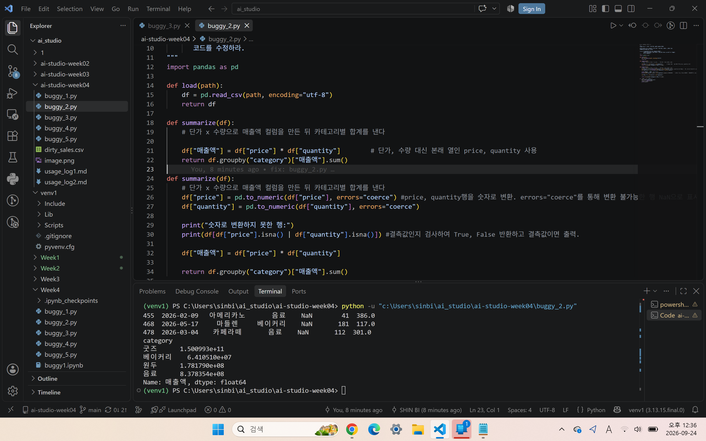

buggy_2

1단계 :
'단가' key가 없어서 멈추었다.

2단계 :
buggy_2.py 20번째 줄 summarize 함수 안의 df["매출액"] = df["단가"]*df["수량"] 문장에서 문제가 발생

3단계 :
25번째 줄에서 summarize를 호출했기 때문에 도달

4단계 :
키가 영어로 되어있음. 그러나 파이썬에서는 한글로 작성됨.

프롬프트 : 
dirt_sales.csv를 pandas로 읽어 카테고리별 매출 합계를 구하는 코드이다. 아래 함수의 n번째 줄에서 첨부한 KeyError가 발생한다. 확인하니 문제 값은 price로 영어로 되어 존재하지 않는 '단가' 문자열이다. 이 Traceback의 원인을 설명하고, 제 가설이 맞는지 검증하는 코드를 제안한 뒤 다른 행에도 같은 문제가 있는지 확인하는 방법을 알려줘.

def summarize(df):
    df["매출액"] = df["단가"] * df["수량"]
    return df.groupby("category")["매출액"].sum()

Traceback (most recent call last):
  File "C:\Users\sinbi\ai_studio\venv1\Lib\site-packages\pandas\core\indexes\base.py", line 3641, in get_loc
    return self._engine.get_loc(casted_key)
           ~~~~~~~~~~~~~~~~~~~~^^^^^^^^^^^^
  File "pandas/_libs/index.pyx", line 168, in pandas._libs.index.IndexEngine.get_loc
  File "pandas/_libs/index.pyx", line 197, in pandas._libs.index.IndexEngine.get_loc
  File "pandas/_libs/hashtable_class_helper.pxi", line 7668, in pandas._libs.hashtable.PyObjectHashTable.get_item
  File "pandas/_libs/hashtable_class_helper.pxi", line 7676, in pandas._libs.hashtable.PyObjectHashTable.get_item
KeyError: '단가'

AI 답변 요지:
print(df.columns) 를 통해 가설 검증
-> 가설이 맞음 'date', 'product', 'category', 'price', 'quantity', 'stock'

"단가"를 "price", "수량"을 "quantity"로 수정 코드 작성.

___

이후 문자열로 인식되어 sum이 숫자를 더하는 것이 아닌 문자열을 이어붙이는 형태가 됨.

프롬프트:
df["매출액"]이 문자열이 되어서 groupby.sum()할 때 문자열 sum이 되는 문제가 발생했어. 원인 설명하고 원인 검증용 코드, 수정 코드 제시해줘

AI 답변 요지 :
price와 quantity의 값을 숫자로 변환시켜서 계산하고 혹시 모를 문자열 ',', '원'이 포함된 값을 NaN으로 하도록 안전한 수정코드 제시.
def summarize(df):
    df["price"] = pd.to_numeric(df["price"], errors="coerce")
    df["수량"] = pd.to_numeric(df["수량"], errors="coerce")

    print("숫자로 변환하지 못한 행:")
    print(df[df["price"].isna() | df["수량"].isna()])

    df["매출액"] = df["price"] * df["수량"]

    return df.groupby("category")["매출액"].sum()
