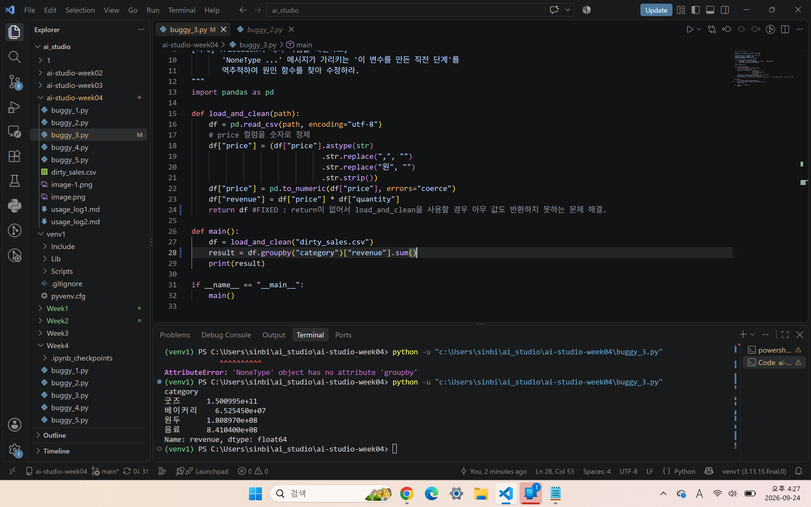

buggy_3

1단계 :
AttributeError : 'NoneType' object has no attribute 'groupby'
None을 반환한 결과에 메서드를 호출했다.

2단계 :
buggy_3.py 28번째 줄 main 함수 안의 result = df.groupby("category")["revenue"].sum()의 문장에서 에러 발생

3단계 :
32번째 줄에서 main()을 호출했기에 도달

4단계 :
가설 - 변수 df가 None으로 되어있음. 이전 함수 load_and_clean(path)에서 return을 하지 않아 변수에 아무것도 할당되지 못하기 때문으로 추측한다.

프롬프트 : 
월별 매출 집계 스크립트야. 아래 함수에서 첨부한 AttributeError가 발생해. 에러 메시지로 추측한 문제 값은 load_and_clean() 함수를 호출한 과정에서 return을 취하지 않아 값이 할당되지 못한 것이야. 
이 Traceback의 원인을 설명하고 내 가설이 맞는지 검증하는 코드를 제안한 뒤 다른 행에도 같은 문제가 있는지 확인하는 방법을 알려줘. 

def load_and_clean(path):
    df = pd.read_csv(path, encoding="utf-8")
    # price 컬럼을 숫자로 정제
    df["price"] = (df["price"].astype(str)
                              .str.replace(",", "")
                              .str.replace("원", "")
                              .str.strip())
    df["price"] = pd.to_numeric(df["price"], errors="coerce")
    df["revenue"] = df["price"] * df["quantity"]
  
def main():
    df = load_and_clean("dirty_sales.csv")
    result = df.groupby("category")["revenue"].sum()
    print(result)

Traceback (most recent call last):
  File "c:\Users\sinbi\ai_studio\ai-studio-week04\buggy_3.py", line 32, in <module>
    main()
    ~~~~^^
  File "c:\Users\sinbi\ai_studio\ai-studio-week04\buggy_3.py", line 28, in main
    result = df.groupby("category")["revenue"].sum() 
             ^^^^^^^^^^
AttributeError: 'NoneType' object has no attribute 'groupby'

AI 답변 요지 :
    print(df)
    print(type(df))
사용해서 가설 검증
-> None
<class 'NoneType'>으로  가설 입증

수정코드 : return df

