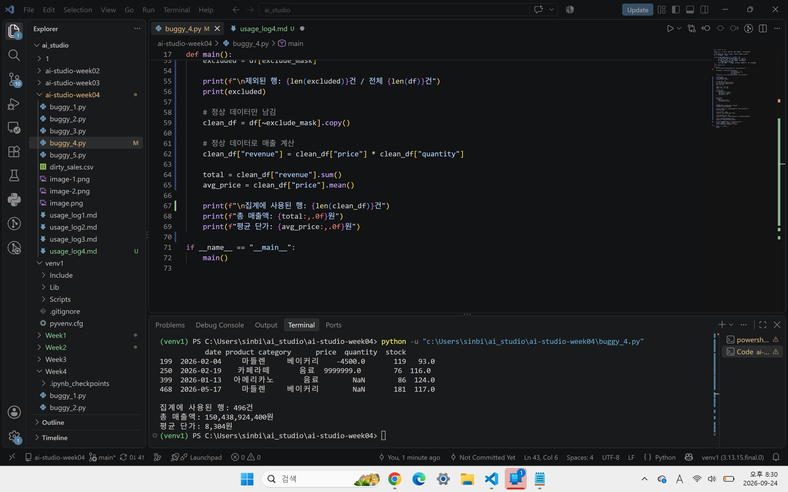

buggy_4

df.info(), df.describe(), df.isna().sum()의 결과는 다음과 같으며, 이를 통해서 결측이 있는 행의 존재를 확인함
(500, 6)
<class 'pandas.DataFrame'>
RangeIndex: 500 entries, 0 to 499
Data columns (total 6 columns):
 #   Column    Non-Null Count  Dtype  
---  ------    --------------  -----  
 0   date      500 non-null    str    
 1   product   500 non-null    str    
 2   category  490 non-null    str    
 3   price     498 non-null    float64
 4   quantity  500 non-null    int64  
 5   stock     485 non-null    float64
dtypes: float64(2), int64(1), str(3)
memory usage: 23.6 KB
None
date         0
product      0
category    10
price        2
quantity     0
stock       15
dtype: int64

price(df["price"].describe()) 를 통해서 이상치 확인. 결과는 다음과 같다. 
count    4.980000e+02
mean     2.834237e+04
std      4.477810e+05
min     -4.500000e+03
25%      3.800000e+03
50%      5.000000e+03
75%      1.200000e+04
max      9.999999e+06
Name: price, dtype: float64

    q1 = df["price"].quantile(0.25)
    q3 = df["price"].quantile(0.75)
    iqr = q3 - q1
    lower = q1 - 1.5*iqr
    upper = q3 + 1.5*iqr
    outliers = df[(df["price"] < lower) | (df["price"]>upper) | (df["price"] <0)]
    print(f"이상치 {len(outliers)}건 / 전체 {len(df)}건")
    print(outliers)
위의 코드를 통해서 IQR 1.5배 이상 벗어난 심각한 outlier를 확인하였다.
date product category      price  quantity  stock
199  2026-02-04     마들렌     베이커리    -4500.0       119   93.0
250  2026-02-19    카페라떼       음료  9999999.0        76  116.0

이상치와 NaN 값으로 인하여 총 매출액을 믿을 수 없는 상황이다. 그러므로 NaN, 이상치를 건너뛰고 sum()하고 제외된 값을 추출하도록 코드를 구성하기로 프롬프트를 작성하기로 결정. 

프롬프트 : 월별 매출 집계 스크립트야. 이상치와 NaN값을 제외하고 sum할 수 있도록 코드 수정 제안해줘. 제외된 행은 제외되었다고 출력할 수 있도록 해줘. 

def main():
    df = pd.read_csv("dirty_sales.csv", encoding="utf-8")

    df["price"] = (df["price"].astype(str)
                              .str.replace(",", "")
                              .str.replace("원", "")
                              .str.strip())
    df["price"] = pd.to_numeric(df["price"], errors="coerce")

    #결측치 및 이상치 행 확인
    print(df.isna().sum())
    print(df[df["price"].isna()].head())

    q1 = df["price"].quantile(0.25)
    q3 = df["price"].quantile(0.75)
    iqr = q3 - q1
    lower = q1 - 1.5*iqr
    upper = q3 + 1.5*iqr
    outliers = df[(df["price"] < lower) | (df["price"]>upper) | (df["price"] <0)]
    print(f"이상치 {len(outliers)}건 / 전체 {len(df)}건")
    print(outliers)

    df["revenue"] = df["price"] * df["quantity"]

    total = df["revenue"].sum()
    avg_price = df["price"].mean()

    print(f"총 매출액: {total:,.0f}원")
    print(f"평균 단가: {avg_price:,.0f}원")

AI 답변 요지 :
수정 코드 제시

    # 결측치 확인
    print("결측치 개수")
    print(df.isna().sum())

    # 이상치 기준 계산
    q1 = df["price"].quantile(0.25)
    q3 = df["price"].quantile(0.75)
    iqr = q3 - q1

    lower = q1 - 1.5 * iqr
    upper = q3 + 1.5 * iqr

    # 이상치 조건
    outlier_mask = (
        (df["price"] < lower) |
        (df["price"] > upper) |
        (df["price"] < 0)
    )

    # NaN 조건
    nan_mask = (
        df["price"].isna() |
        df["quantity"].isna()
    )

    # 제외할 행
    exclude_mask = outlier_mask | nan_mask
    excluded = df[exclude_mask]

    print(f"\n제외된 행: {len(excluded)}건 / 전체 {len(df)}건")
    print(excluded)

    # 정상 데이터만 남김
    clean_df = df[~exclude_mask].copy()

    # 정상 데이터로 매출 계산
    clean_df["revenue"] = clean_df["price"] * clean_df["quantity"]

    total = clean_df["revenue"].sum()
    avg_price = clean_df["price"].mean()

    print(f"\n집계에 사용된 행: {len(clean_df)}건")
    print(f"총 매출액: {total:,.0f}원")
    print(f"평균 단가: {avg_price:,.0f}원")

    