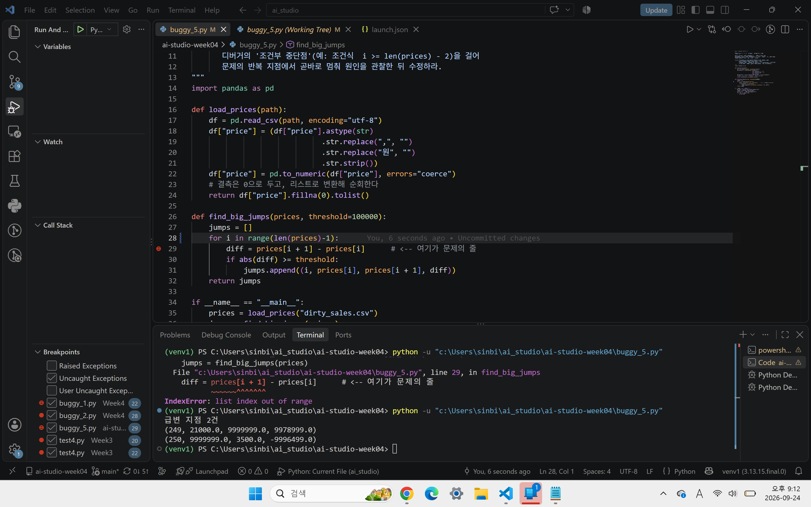

buggy_5

1단계 : 
IndexError: list index out of range
Index의 범위를 벗어난 위치를 참조했다.

2단계 : 
buggy_5.py 29번째 줄 find_big_jumps 함수 내의 diff = prices[i + 1] - prices[i] 문장에서 문제가 발생

3단계 : 
36번째 줄에서 find_big_jumps(prices)를 호출했기 때문에 29번째 줄에 도달했다. 

4단계 : 
for 반복문의 범위를 인덱스 너머까지 했음을 추측
가설검증 - 디버거를 통하여 i>=len(prices) -2부터 for문을 반복, i=499일 때 Error가 발생하는 것을 확인하여 for 반복문의 범위가 잘못되었음을 확인

프롬프트 : 
월별 매출 집계 스크립트야. 아래 함수에서 IndexError가 발생해. Traceback을 통해 추측한 결과 for 반복문의 범위가 인덱스 너머까지 했다는 가설을 세웠어. 
이 Traceback의 원인을 설명하고 내 가설이 맞는지 검증하는 코드를 제안한 뒤 다른 행에도 같은 문제가 있는지 확인하는 방법을 알려줘. 

def find_big_jumps(prices, threshold=100000):
    jumps = []
    for i in range(len(prices)):
        diff = prices[i + 1] - prices[i]      # <-- 여기가 문제의 줄
        if abs(diff) >= threshold:
            jumps.append((i, prices[i], prices[i + 1], diff))
    return jumps

AI 답변 요지 : 
가설이 맞음을 확인. 
range(len(prices) - 1)
으로 코드 수정 가능. 

제시해준 가설 검증 코드
def find_big_jumps(prices, threshold=100000):
    jumps = []

    for i in range(len(prices)):
        print(
            "i =", i,
            "i+1 =", i + 1,
            "len(prices) =", len(prices)
        )

        if i + 1 >= len(prices):
            print("범위를 벗어나는 인덱스 발견:", i + 1)

        diff = prices[i + 1] - prices[i]

        if abs(diff) >= threshold:
            jumps.append((i, prices[i], prices[i + 1], diff))

    return jumps

    